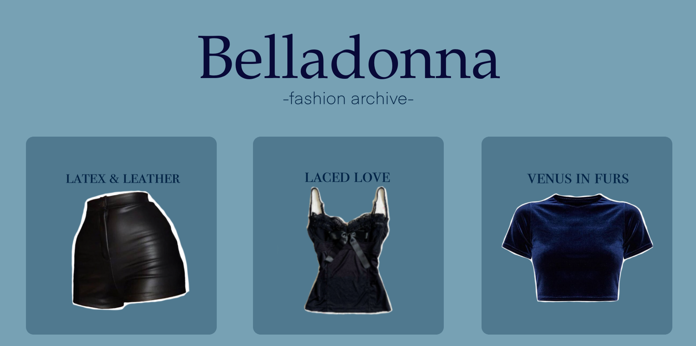

# Belladonna fashion blog
A tulip themed fashion website project created by GLAM

## introduction
"Belladonna" is a beginner website building project, it is a fashion blog that centers around a specificly currated visual experience. 
The theme of the website is tulips. It is an easy to navigate and design-heavy website that is made to feel simple, soft and glam at the same 
time. It was built and designed using HTML and CSS. 

## navigation
+ The landing page (6 chosen articles, about and veiw full archive buttons)
+ The about page
+ The full archive page (contains all articles)

## known issues

- there is a problem with device compatability (when veiwed on different devices the formatting of the website is wrong)
